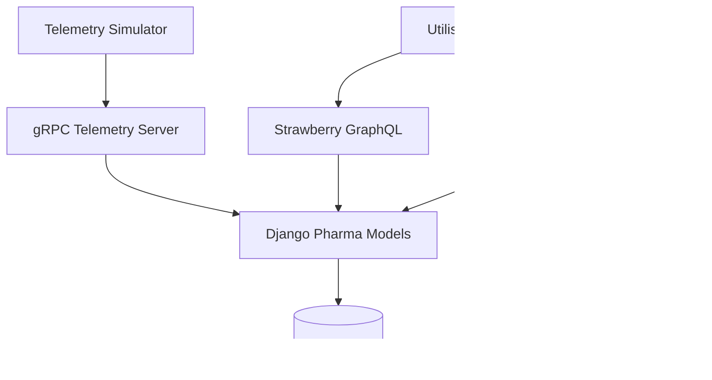

# PharmaSovereign-TN — Architecture générale

```mermaid
flowchart TB
    USER["Utilisateurs"]
    REST["Django REST Framework + JWT"]
    GRAPHQL["Strawberry GraphQL"]
    GRPC["gRPC Telemetry Server"]
    MODELS["Django Pharma Models"]
    DB[("PostgreSQL")]
    REDIS[("Redis")]
    SIM["Telemetry Simulator"]

    USER --> REST
    USER --> GRAPHQL
    SIM --> GRPC

    REST --> MODELS
    GRAPHQL --> MODELS
    GRPC --> MODELS

    MODELS --> DB
    REST -.-> REDIS
```
