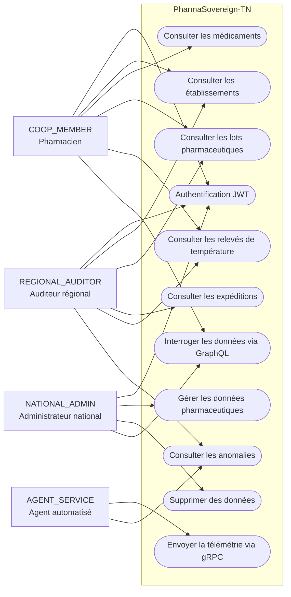

# PharmaSovereign-TN — Use Case Diagram

```mermaid
flowchart LR
    %% Actors
    PHARM["COOP_MEMBER<br/>Pharmacien"]
    AUDIT["REGIONAL_AUDITOR<br/>Auditeur régional"]
    ADMIN["NATIONAL_ADMIN<br/>Administrateur national"]
    AGENT["AGENT_SERVICE<br/>Agent automatisé"]

    subgraph SYSTEM["PharmaSovereign-TN"]
        direction TB

        UC1(["Authentification JWT"])
        UC2(["Consulter les établissements"])
        UC3(["Consulter les médicaments"])
        UC4(["Consulter les lots pharmaceutiques"])
        UC5(["Consulter les expéditions"])
        UC6(["Consulter les relevés de température"])
        UC7(["Consulter les anomalies"])
        UC8(["Interroger les données via GraphQL"])
        UC9(["Envoyer la télémétrie via gRPC"])
        UC10(["Gérer les données pharmaceutiques"])
        UC11(["Supprimer des données"])
    end

    PHARM --> UC1
    PHARM --> UC2
    PHARM --> UC3
    PHARM --> UC4
    PHARM --> UC6
    PHARM --> UC8

    AUDIT --> UC1
    AUDIT --> UC2
    AUDIT --> UC4
    AUDIT --> UC5
    AUDIT --> UC6
    AUDIT --> UC7

    ADMIN --> UC1
    ADMIN --> UC10
    ADMIN --> UC11
    ADMIN --> UC8

    AGENT --> UC9
    AGENT --> UC7
```
