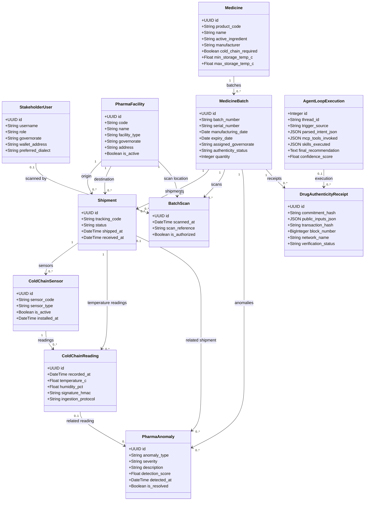

# Diagramme de classes — PharmaSovereign-TN

```mermaid
classDiagram
direction TB

class StakeholderUser {
  +UUID id
  +String username
  +String role
  +String governorate
  +String wallet_address
  +String preferred_dialect
}

class PharmaFacility {
  +UUID id
  +String code
  +String name
  +String facility_type
  +String governorate
  +String address
  +Boolean is_active
}

class Medicine {
  +UUID id
  +String product_code
  +String name
  +String active_ingredient
  +String manufacturer
  +Boolean cold_chain_required
  +Float min_storage_temp_c
  +Float max_storage_temp_c
}

class MedicineBatch {
  +UUID id
  +String batch_number
  +String serial_number
  +Date manufacturing_date
  +Date expiry_date
  +String assigned_governorate
  +String authenticity_status
  +Integer quantity
}

class Shipment {
  +UUID id
  +String tracking_code
  +String status
  +DateTime shipped_at
  +DateTime received_at
}

class ColdChainSensor {
  +UUID id
  +String sensor_code
  +String sensor_type
  +Boolean is_active
  +DateTime installed_at
}

class ColdChainReading {
  +UUID id
  +DateTime recorded_at
  +Float temperature_c
  +Float humidity_pct
  +String signature_hmac
  +String ingestion_protocol
}

class BatchScan {
  +UUID id
  +DateTime scanned_at
  +String scan_reference
  +Boolean is_authorized
}

class PharmaAnomaly {
  +UUID id
  +String anomaly_type
  +String severity
  +String description
  +Float detection_score
  +DateTime detected_at
  +Boolean is_resolved
}

class DrugAuthenticityReceipt {
  +UUID id
  +String commitment_hash
  +JSON public_inputs_json
  +String transaction_hash
  +BigInteger block_number
  +String network_name
  +String verification_status
}

class AgentLoopExecution {
  +Integer id
  +String thread_id
  +String trigger_source
  +JSON parsed_intent_json
  +JSON mcp_tools_invoked
  +JSON skills_executed
  +Text final_recommendation
  +Float confidence_score
}

Medicine "1" --> "0..*" MedicineBatch : batches
MedicineBatch "1" --> "0..*" Shipment : shipments

PharmaFacility "1" --> "0..*" Shipment : origin
PharmaFacility "1" --> "0..*" Shipment : destination

Shipment "1" --> "0..*" ColdChainSensor : sensors
ColdChainSensor "1" --> "0..*" ColdChainReading : readings
Shipment "1" --> "0..*" ColdChainReading : temperature readings

MedicineBatch "1" --> "0..*" BatchScan : scans
PharmaFacility "1" --> "0..*" BatchScan : scan location
StakeholderUser "0..1" --> "0..*" BatchScan : scanned by

MedicineBatch "1" --> "0..*" PharmaAnomaly : anomalies
Shipment "0..1" --> "0..*" PharmaAnomaly : related shipment
ColdChainReading "0..1" --> "0..*" PharmaAnomaly : related reading

MedicineBatch "1" --> "0..*" DrugAuthenticityReceipt : receipts
AgentLoopExecution "0..1" --> "0..*" DrugAuthenticityReceipt : execution
```
